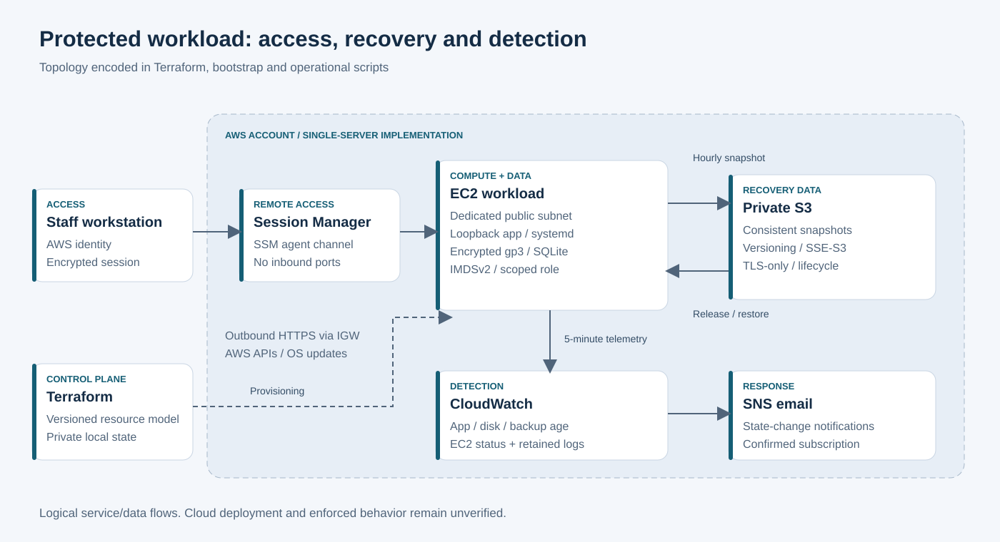

# Northstar Repairs — recoverable small-business infrastructure

**An implemented proof of concept by Shemar Marks:** a repair-workflow application and the infrastructure code that protects its data, controls remote access, detects operational failures, and reconstructs its hosting environment.

Northstar Repairs represents a five-person repair shop whose active jobs depend on one on-premises VM. The business risk is losing repair records and interrupting customer collections when that VM fails. The implementation addresses that risk with consistent off-host snapshots, an explicit restore path, restricted AWS access, operational telemetry, and infrastructure as code.

**Verification:** application, persistence and SQLite recovery tests passed locally and on a Linux GitHub Actions runner. Terraform passed provider-schema validation. Proxmox migration, AWS deployment and cloud recovery have not yet been executed; no measured cloud availability, RPO or RTO is claimed.

## The implementation

| Business need | Implemented mechanism | Source |
|---|---|---|
| Preserve the repair process | Authenticated intake and status tracking with durable SQLite records | [Application](app/server.py) |
| Recreate hosting | Terraform provisions compute, network, identity, storage and alarms; bootstrap installs the workload | [Infrastructure](terraform/main.tf), [bootstrap](deploy/bootstrap.sh.tftpl) |
| Restrict remote exposure | Loopback listener, zero security-group ingress, Session Manager access, IMDSv2 | [Service](deploy/northstar.service), [security model](docs/IAM.md) |
| Recover business records | Consistent snapshots, hourly S3 uploads, verified restore and preserved rollback data | [Snapshot](scripts/snapshot.py), [backup](scripts/backup.sh), [restore](scripts/restore.sh) |
| Detect operational failure | App, disk and backup-age signals; four alarms and SNS delivery | [Telemetry](scripts/metrics.sh), [monitoring definitions](terraform/main.tf) |
| Keep scope proportionate | Small compute and bounded storage/log retention; no NAT, ALB or managed database | [Decisions](docs/DECISIONS.md), [cost model](docs/COSTS.md) |

## Architecture

The same application provides the Proxmox baseline workload and the AWS recovery target. Staff reach the service through an encrypted tunnel. An instance role separates release reads from backup writes. S3 holds data independently of the root disk; CloudWatch reports the state of the application and its backup process.

[Baseline and production-reference diagrams](docs/ARCHITECTURE.md) explain the original failure boundary and the additional services justified by production requirements. The production reference is separate from the implemented single-server scope.

## Engineering record

- [Case study](docs/CASE-STUDY.md): business risk, intervention and substantiated findings.
- [Implementation](docs/IMPLEMENTATION.md): application, bootstrap, IAM, backup and monitoring behavior.
- [Decisions](docs/DECISIONS.md): alternatives, constraints and tradeoffs.
- [Evidence](evidence/README.md): actual test results and execution limits.
- [Recovery runbook](docs/RUNBOOK.md): the operational artifact for diagnosis, restore and replacement.

## Scope

The proof of concept uses synthetic data, a single server, one shared staff credential and same-account regional backups. It implements recovery mechanisms rather than high availability. Versioning is not immutable retention; local health telemetry is not an external availability check. Recovery objectives are a normal hourly data-loss window and a 30-minute operator-led restore, both design targets rather than measured cloud outcomes.

This repository contains application code, Terraform, configuration, automation, diagrams and an engineering record. Personal deployment coaching and raw account evidence are maintained separately.
