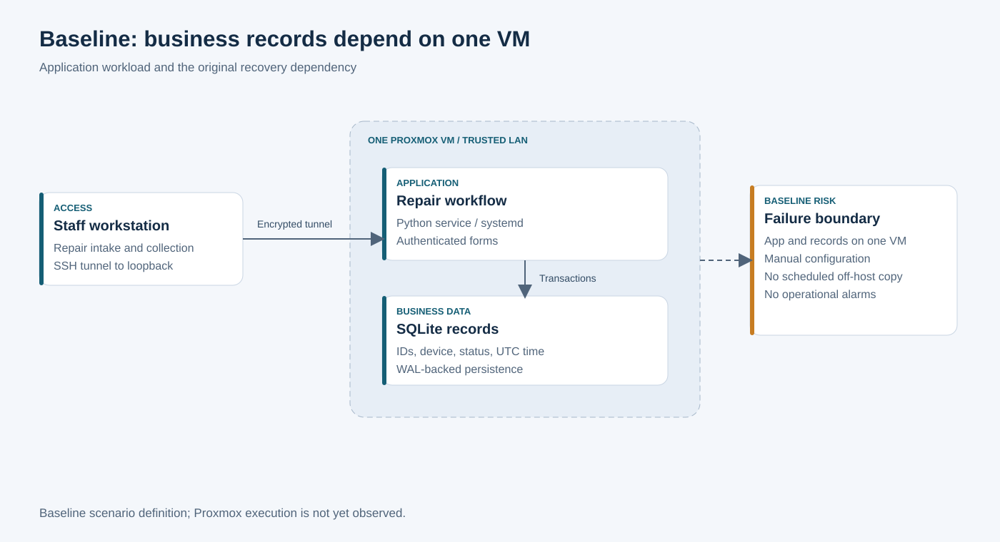
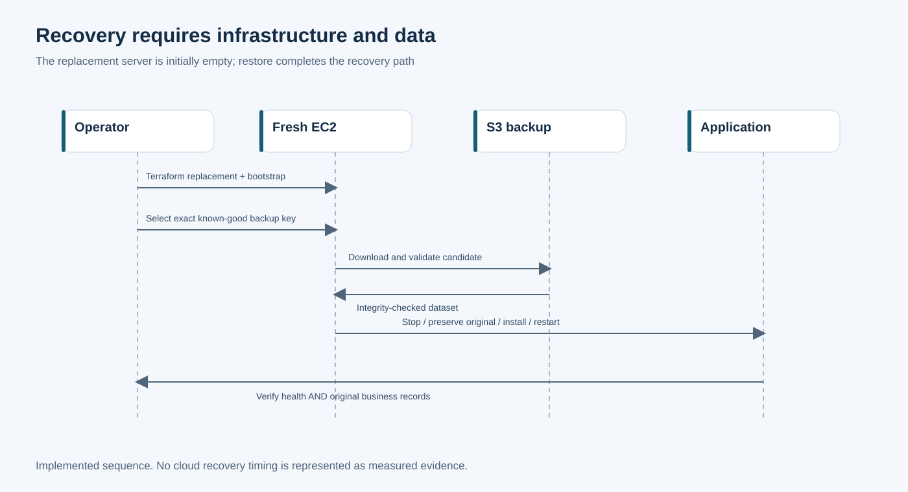
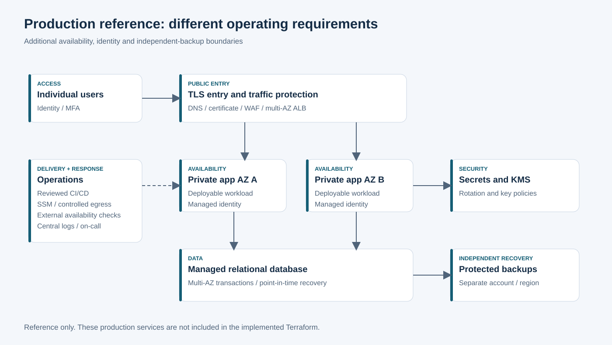

# System architecture

## Baseline dependency

The baseline places the application and its records on one Proxmox-hosted Ubuntu VM. Its meaningful weakness is the recovery dependency: manual configuration, no scheduled off-host data copy and no operational alarm model. The baseline still uses safe LAN/tunnel access.

## Implemented AWS topology

One EC2 instance hosts the same application and SQLite dataset. The security group has zero ingress. A public address and IGW support outbound HTTPS for SSM, S3, monitoring and OS packages. Logical staff access travels through the SSM agent's encrypted channel, not an inbound application port.

S3 separates recoverable records from the root disk. The role reads release/backup objects and writes only backups; monitoring reports both application condition and backup freshness. Terraform describes the resource relationships and a release fingerprint triggers visible replacement when packaged code changes.

The diagram represents the code-defined topology. It does not assert an observed deployment. [Implementation detail](IMPLEMENTATION.md) and [decisions](DECISIONS.md) document the exact controls and their limitations.

## Recovery sequence

A newly provisioned server is not a recovered business service until a verified snapshot is restored and original records are compared. The restore preserves the previous DB/journal files for rollback. Infrastructure and data recovery are separate, explicit stages.

## Production reference

The reference introduces individual identity, managed TLS, multi-AZ application hosting, managed relational storage, protected cross-account/region backups, secrets rotation and external availability checks. These services are not in the implemented Terraform. Their inclusion depends on real operating requirements and an operating budget rather than the portfolio scope alone.
