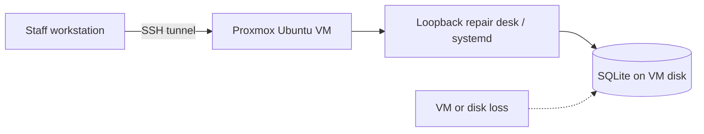
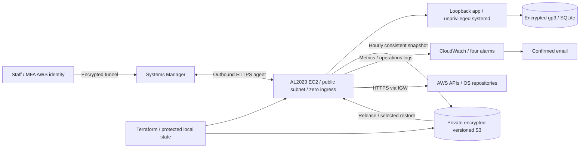
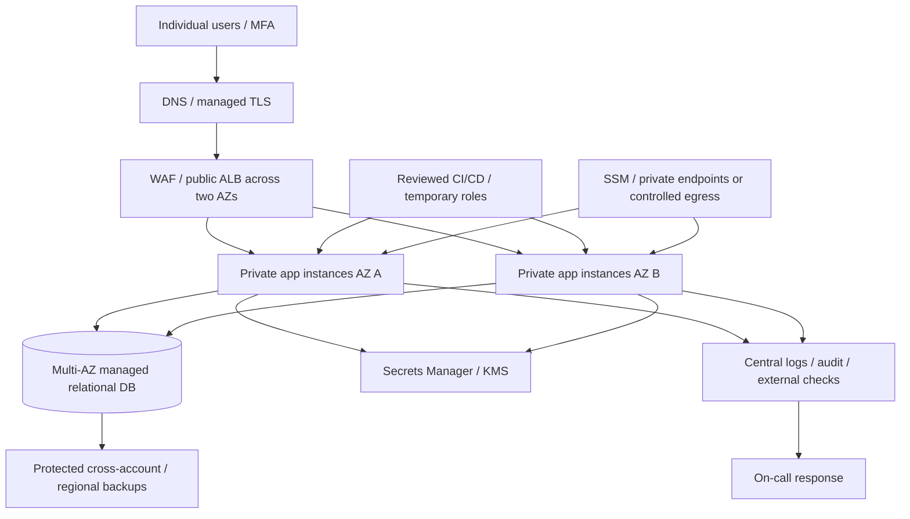

# Architecture

## Proxmox baseline

Manual installation, absent scheduled off-host backup/monitoring, operator-dependent rebuild. Access remains safe on trusted LAN. A Proxmox backup is complementary but counts only if actually configured and restored.

## Deployed single-server lab

Public IPv4/IGW supply outbound access without NAT or paid endpoints. Zero inbound SG rules; outbound TCP443 only. Amazon-provided VPC DNS works independently of SG egress rules. App credential is generated on host. EBS uses its AWS-managed key; S3 SSE-S3 avoids a custom KMS key. Versioned backups and scoped IAM reduce accidental loss, not privileged compromise. Cron/agent run as root; app runs as northstar. Solo local state has no shared backend locking.

## Production reference — not deployed

Reference only; no production Terraform is supplied. Replace SQLite/shared credentials with managed DB and individual roles, add TLS, multi-AZ scaling, secrets rotation, protected cross-account backup and tested point-in-time restore. Add WAF/rate limits, patches, audit logs, external availability checks and explicit SLO/RPO/RTO requirements. Price private endpoints/controlled egress and recurring services separately. Actual customer information requires appropriate privacy and retention requirements.
