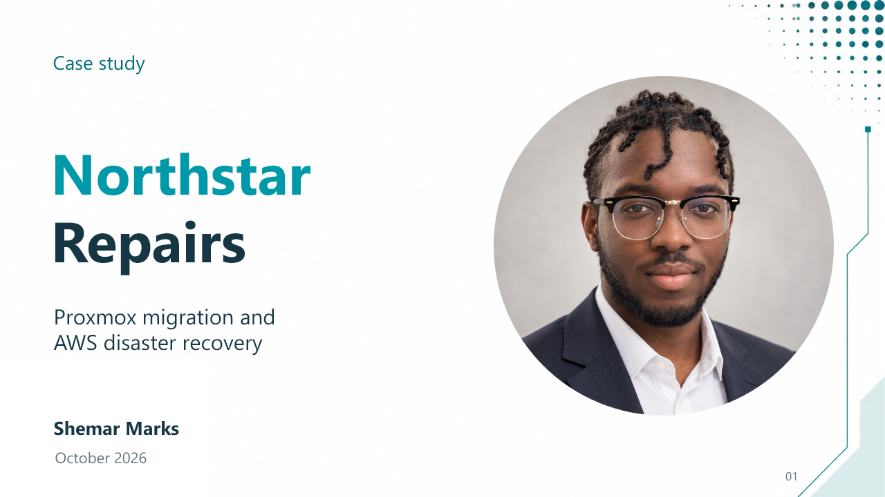

# Northstar Repairs case study

[Download the editable 12-slide PowerPoint](Northstar-Repairs-Case-Study.pptx).

The presentation follows the repair register from its original Proxmox VM through migration to AWS and recovery on a replacement host. Its white, teal and navy design draws on the supplied case-study visual reference, with Shemar Marks's portrait on the cover, repair imagery and official AWS architecture icons. Editable diagrams show the architecture, access controls, migration path and six-to-zero-to-six recovery sequence. A native chart compares the operator-measured 12-minute RTO with the 30-minute design target.

The recovered job table and CloudWatch/SNS email screenshot are displayed as original evidence. Source attribution and measurement limits appear in speaker notes and the [evidence record](../../evidence/README.md). This was a synthetic business scenario and an executed infrastructure lab, not a client engagement. [AWS teardown](../TEARDOWN.md) is complete.

[Image sources and illustration prompts](assets/README.md).
