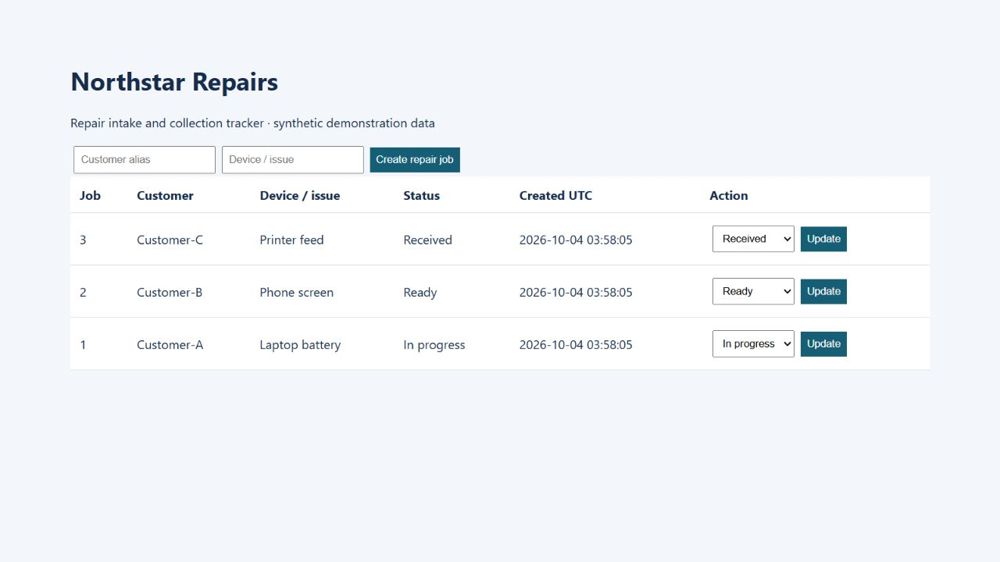

# Verification evidence

This directory contains observed local execution, with source hashes and actual command output. It contains no simulated AWS screenshots or inferred cloud results.

## Application and local recovery

The image renders an HTML response captured from the actual application running locally with three synthetic jobs. It is a workload demonstration, not evidence of Proxmox or AWS hosting. The short-lived form tokens were replaced with an expired preview value before publication; the screenshot's visible data comes from the live response.

| Observed check | Result | Record |
|---|---|---|
| Authenticated intake and status updates | Passed | [Test output](local-test-results.txt) |
| Unauthenticated/invalid-CSRF rejection | Passed | [Test output](local-test-results.txt) |
| HTML escaping and invalid-input rejection | Passed | [Test output](local-test-results.txt) |
| Records survive app process restart | Passed | [Test output](local-test-results.txt) |
| Committed WAL data included in snapshot | Passed | [Recovery test](../tests/test_recovery.py) |
| Missing source rejected without empty backup | Passed | [Test output](local-test-results.txt) |
| Dataset removed and restored locally | Three original IDs/records/statuses match; integrity ok | [Structured record](local-verification.json) |
| Bash parsing of deployment/operations scripts | Passed | [Structured record](local-verification.json) |

Four tests passed. The structured record includes execution time, exact before/restored records and source SHA256 values. The local restore uses the actual snapshot implementation and an independently stored local file; it does not execute S3 transfer or the Linux restore script.

## Hosted verification

The same four tests and shell-syntax checks also passed on an Ubuntu 24.04.5 GitHub-hosted runner for commit `09ddece`. The [actual workflow run](https://github.com/Shemarhn/northstar-aws-recovery/actions/runs/37175839709) and [captured test-log excerpt](hosted-test-results.txt) provide a second execution environment. This is application/recovery verification under Linux, not an AWS deployment test. The read-only verification workflow is committed under .github/workflows/.

## Infrastructure verification boundary

Terraform 1.9.8 formatting and provider-schema validation previously passed with AWS 5.100.0 and archive 2.8.1. The lockfile records these dependencies. These checks establish syntactic/schema validity, not an observed AWS deployment.

Proxmox migration, EC2 bootstrap, enforced IAM/SG controls, scheduled S3 backups, delivered alarm emails, instance replacement and teardown have no execution evidence yet. No achieved cloud RPO/RTO, uptime or cost reduction is asserted. The design diagrams document the implementation topology and its limits.
