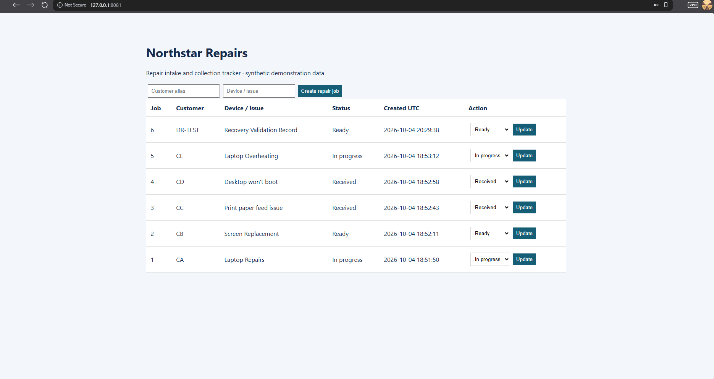
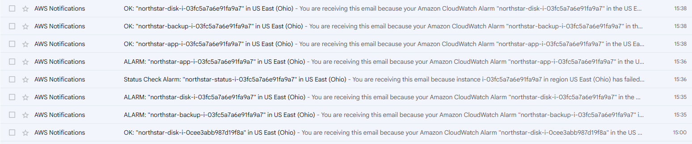

# Verification evidence

## Proxmox and AWS exercise

The operator completed migration and recovery in us-east-2 on 2026-10-04. This index distinguishes original retained artifacts from operator measurements and the prior project record. No AWS screenshot is simulated.

| Artifact or result | What it supports | Limits |
|---|---|---|
| [Post-recovery app](disaster-recovery/post-recovery-app.png) | Six visible jobs, IDs 1–6, DR-TEST Ready | Local forwarded URL alone does not identify the host. AWS replacement attribution comes from the project record |
| [CloudWatch/SNS email list](monitoring/cloudwatch-sns-email.png) | App, disk, backup ALARM/OK delivery and status-check alarm in Ohio | Email bodies and timezone not visible. Causes and detection latency not established |
| [Recovery summary](disaster-recovery/observed-results.md) | Attributed 0-to-6 restore, integrity ok and 12-minute operator measurement | Summary, not a raw terminal transcript |
| [Recovery timeline](disaster-recovery/recovery-timeline.md) | Operator-supplied UTC endpoints, timing boundary and 720-second elapsed duration including interruption | Sanitized operator record, not a raw command transcript or repeatability test |
| Proxmox baseline and migration | Operator reports completed Proxmox-to-AWS lab | Earlier baseline/migration attachments unavailable in the retrieved history |
| [Teardown verification](teardown/verification.json) | 25 resources destroyed, empty state, no active Northstar lab resources | Historical instance/metric records can remain |

Original recovered PNGs were inspected for passwords, keys, account IDs and private contact details. None are visible. Synthetic customer aliases and resource instance IDs remain. [SHA256 manifest](SHA256SUMS.txt) identifies the preserved screenshots.

## Application and local recovery

The image renders an HTML response captured from the actual application running locally with three synthetic jobs. It is a workload demonstration, not evidence of Proxmox or AWS hosting. The short-lived form tokens were replaced with an expired preview value before publication; the screenshot's visible data comes from the live response.

| Observed check | Result | Record |
|---|---|---|
| Authenticated intake and status updates | Passed | [Test output](local-test-results.txt) |
| Unauthenticated/invalid-CSRF rejection | Passed | [Test output](local-test-results.txt) |
| HTML escaping and invalid-input rejection | Passed | [Test output](local-test-results.txt) |
| Records survive app process restart | Passed | [Test output](local-test-results.txt) |
| Committed WAL data included in snapshot | Passed | [Recovery test](../tests/test_recovery.py) |
| Missing source rejected without empty backup | Passed | [Test output](local-test-results.txt) |
| Dataset removed and restored locally | Three original IDs/records/statuses match; integrity ok | [Structured record](local-verification.json) |
| Bash parsing of deployment/operations scripts | Passed | [Structured record](local-verification.json) |

Four tests passed. The structured record includes execution time, exact before/restored records and source SHA256 values. The local restore uses the actual snapshot implementation and an independently stored local file; it does not execute S3 transfer or the Linux restore script.

## Hosted verification

The same four tests and shell-syntax checks also passed on an Ubuntu 24.04.5 GitHub-hosted runner for commit `09ddece`. The [actual workflow run](https://github.com/Shemarhn/northstar-aws-recovery/actions/runs/37175839709) and [captured test-log excerpt](hosted-test-results.txt) provide a second execution environment. This is application/recovery verification under Linux, not an AWS deployment test. The read-only verification workflow is committed under .github/workflows/.

## Infrastructure checks and remaining limits

Terraform formatting and provider-schema validation previously passed with Terraform 1.9.8, AWS 5.100.0 and archive 2.8.1. The deployed lab now has operator-observed migration/recovery and original final screenshots. Those artifacts do not establish exhaustive security enforcement tests, measured RPO, uptime or actual costs. Preserve private state, deployment values and backup exports outside the public repository.

## Live closeout checks

[Direct CloudShell verification](disaster-recovery/closeout-checks.md) confirms the six-job healthy app, SQLite integrity and exported migration/recovery backup contents.

## Completed teardown

[Teardown record](../docs/TEARDOWN.md) and [verified cleanup screenshot](teardown/verified-cleanup.png) document the 25-resource destruction and independent AWS inventory checks. Private backup exports remain outside the public repository in CloudShell.
